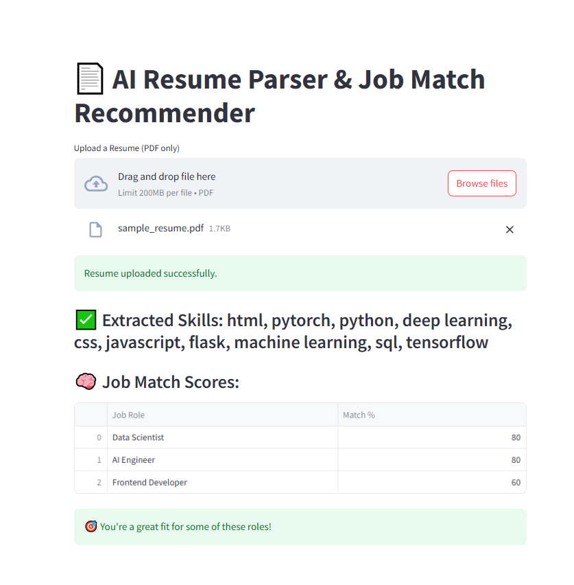

# 🧠 Resume Parser & Job Match Recommender

An AI-powered resume analyzer that extracts skills from uploaded PDF resumes and recommends job roles based on your fit. Built with Streamlit, this tool is ideal for job seekers, students, or portfolio demos.

## 🚀 Features

- Upload PDF resumes
- Extract keywords and skills using NLP
- Compare against predefined job roles
- Show match percentage for each job
- Clean UI with Streamlit

## 📁 File Structure

resume-matcher/
├── app.py
├── resume_parser.py
├── job_matcher.py
├── job_descriptions.json
├── uploads/
├── assets/
├── requirements.txt
└── README.md

## 🛠️ Tech Stack

- Python 🐍
- Streamlit
- PyMuPDF (fitz)
- spaCy (optional for advanced parsing)
- pandas

## 📂 Sample Jobs (`job_descriptions.json`)

```json
{
  "Data Scientist": ["python", "machine learning", "statistics", "sql", "deep learning"],
  "Frontend Developer": ["javascript", "react", "html", "css", "ui/ux"],
  "AI Engineer": ["python", "deep learning", "pytorch", "tensorflow", "nlp"]
}

📦 Installation

pip install -r requirements.txt
streamlit run app.py


## 🖼️ Demo Screenshot

Here's a preview of the Resume Matcher in action:




📬 Contact
Want to build something similar or need help with a project?
GitHub: Pandapuneeth
Portfolio: Coming soon 😎

